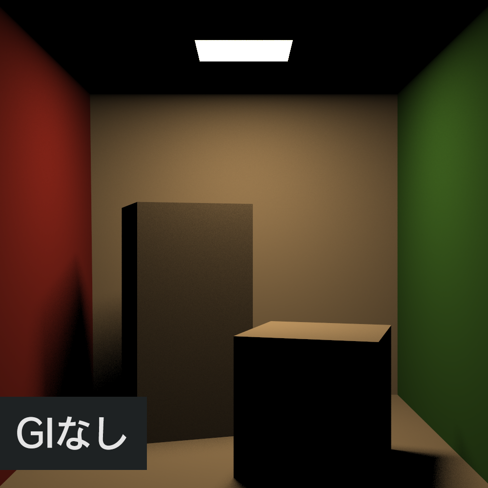
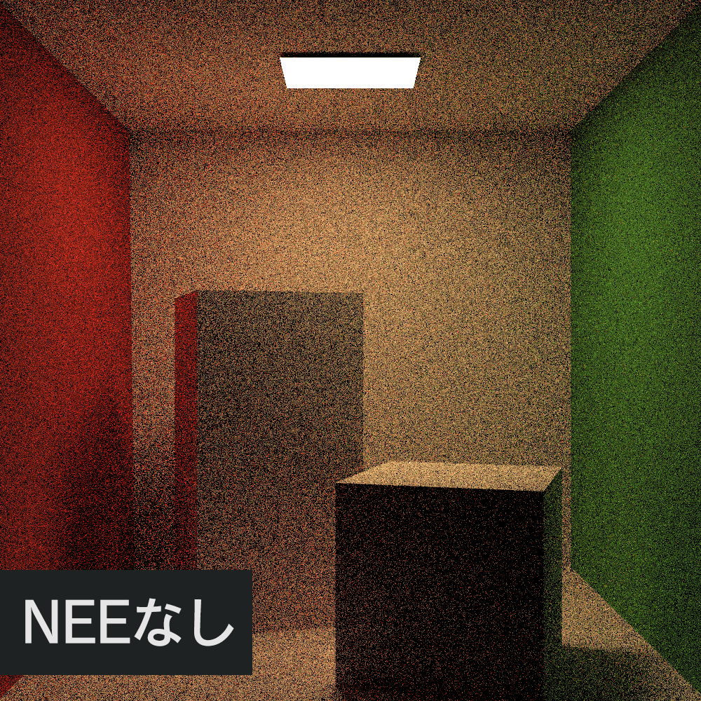
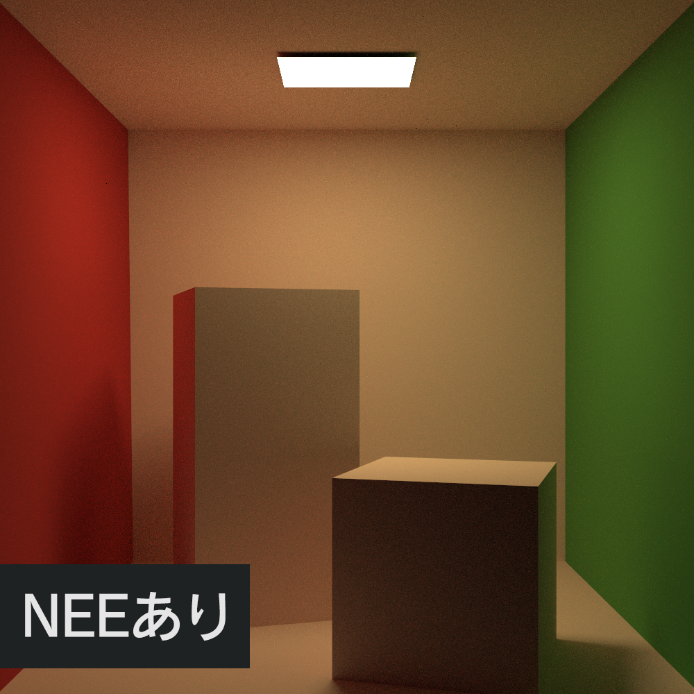
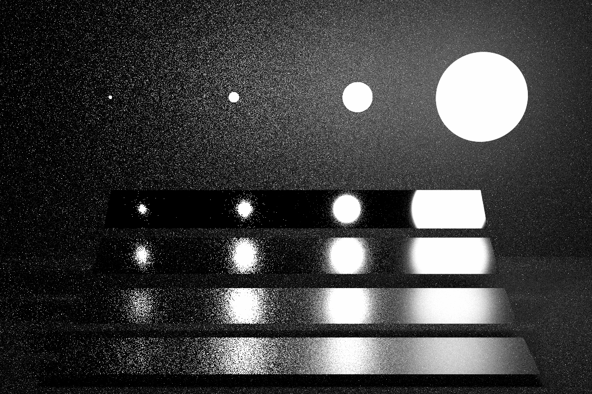
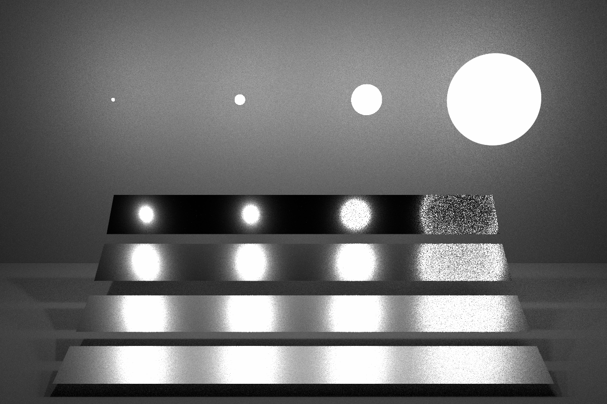
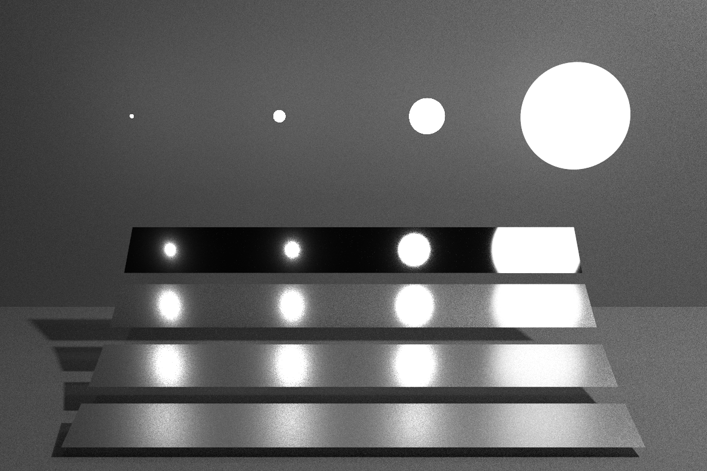
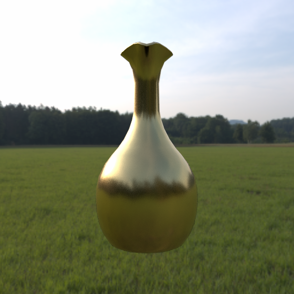
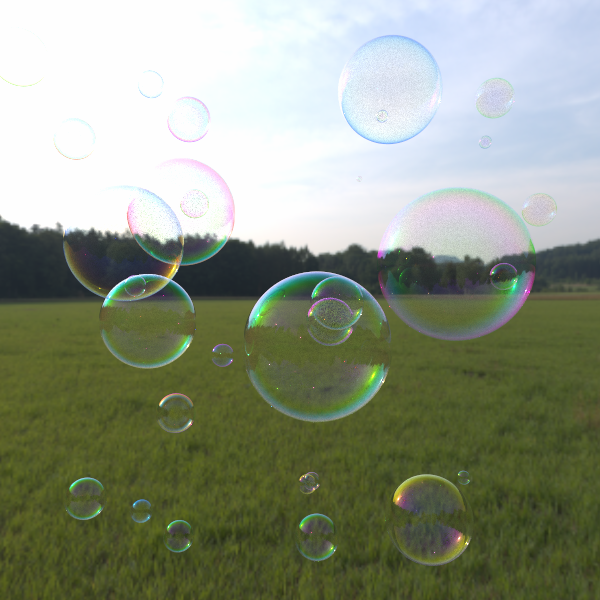
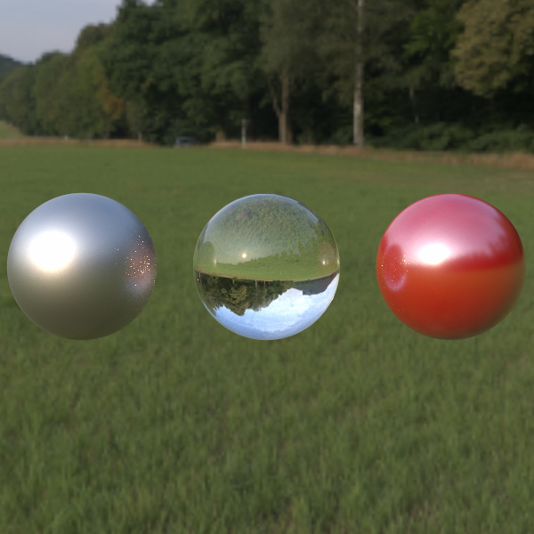

# testpt

  
  
図1 パストレーシングによるレンダリング結果 

## 概要

`testpt`はレンダリングの勉強のために作成したパストレーサーです．クラス設計や実装は[Raytracing in one weekend](https://raytracing.github.io/)と[pbrt-v3](https://github.com/mmp/pbrt-v3)を参考にしました．図1に示す三角ポリゴンで構成されたシーン(コーネルボックス)をレンダリングすることができます．

## 開発環境

Windows 10  
Microsoft Visual Studio 2019  
C++17  
[stb](https://github.com/nothings/stb)(画像入出力用のライブラリ)

## 機能

主に以下の機能を実装しています．

- グローバルイルミネーション
- 明示的な光源サンプリング
- 重点的サンプリング
- 3Dモデル(.obj)の読み込み
- マイクロファセット理論に基づくマテリアル
- 薄膜干渉マテリアル
- 簡単なイメージベーストライティング

### グローバルイルミネーション

パストレーシングでは，グローバルイルミネーション(GI: Global Illumination)の効果を考慮した画像生成ができます．図2に示す通り，GIを考慮することで壁で反射した光が他の物体を照らす間接照明が再現でき，リアリスティックな画像を生成できます．

  
  
   図2 グローバルイルミネーション(GI)の有無による表示結果 

### 明示的な光源サンプリング

ナイーブなパストレーシングではランダムにレイをサンプリングして経路構築を行います．そのため，光源をサンプリングできない場合があり，その影響がノイズとして画像に表れます．この問題を解決するために，明示的な光源サンプリングを実装しています．これにより，図3に示す通りノイズの少ない画像を生成することが出来ます．明示的な光源サンプリングをNEE(Next Event Estimation)と呼ぶことがあるそうです．

  
  
   図3 光源サンプリング(NEE)の有無による表示結果 

### 重点的サンプリング

効率よくレイをサンプリングするために，高い寄与が期待される箇所にサンプルを集中させる重点的サンプリング(IS: Importance Sampling)も実装しています．図4は表面粗さの異なるプレート(上に行くほど滑らかになる)と大きさの異なる光源が含まれるシーンの表示結果です．
左の画像はBRDF(反射特性)に基づいたISによる結果で，右の画像は光源分布に基づいたISによる結果です．どちらの場合でも，上手くサンプリング出来ている箇所とそうでない箇所があります．

  
  
   図４ 重点的サンプリングを用いた表示結果(シーン: https://pbrt.org/scenes-v3) 

### 多重重点的サンプリング

BRDFと光源分布の両方を考慮してサンプリングを行う多重重点的サンプリング(MIS: Multiple Importance Sampling)も実装しています．図5は図4と同一のシーンにMISを用いてレンダリングした表示結果です．複数要素を考慮することで，より効率よくレイのサンプリングが行えます．
testptでは，明示的な光源サンプリングでMISを，経路構築に反射特性に基づいたISを採用しています．

  
  
図5 多重重点的サンプリングを用いた表示結果

### 様々な材質

レンダリング品質の向上以外にも表現の幅を広げるために，様々な材質を実装しています．図5に示す通り，プラスチック，金属，ガラス，薄膜干渉など幅広い材質を表示できます．

  
  
  
  
図5 様々な材質の表示結果 

## 参考文献

- [Moller and Trumbore 1997] "Fast, minimum storage ray-triangle intersection" JGT. 1997.
- [Walter et al. 07] "Microfacet Models for Refraction through Rough Surfaces". EGSR 2007.
- [Shirley and Morley 2008] "Realistic Ray Tracing". 2008.
- [Pharr et al. 2016] "Physically Based Rendering: From Theory To Implementation" 2016.
- [Shirley 2020]. "Raytracing in one weekend" 2020.
