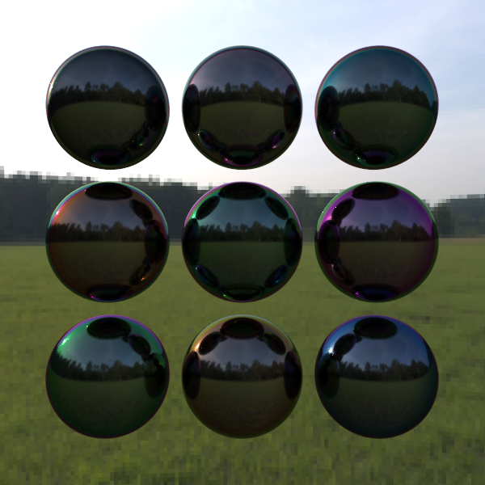
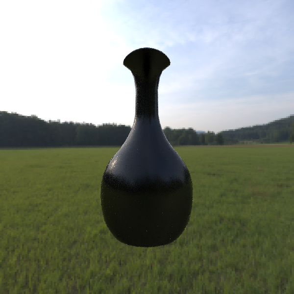

## 概要

オブジェクト指向プログラミングやCGの勉強のために[Raytracing in one weekend](https://raytracing.github.io/)のソースコードを参考に作成したC++によるナイーブなパストレーサーです．実行すると三角ポリゴンと球で構成されたシーン(コーネルボックス)をレンダリングします．

### 開発環境 

Windows 10  
Microsoft Visual Studio 2019  
C++17

### 実行方法

testpt.exeを実行するかソースコードをビルドしてください．  
次のコマンドで1ピクセルあたり100サンプルのパストレーシングを実行し下図のような画像が生成されます．
```bash
testpt.exe 100
```

### 機能

Raytracing in one weekendにない機能として以下のものがあります．

- 三角ポリゴンとレイの交差判定，
- Wavefront OBJ形式のモデルの読み込み
- マイクロファセットモデルや薄膜干渉のマテリアル．
- 簡単なイメージベーストライティング

これらを用いると下図のような画像を生成することも可能です(別途ポリゴンモデルと環境マップが必要です)．

<p>
  
  
</p>

### 参考文献

[MT97] T.Moller, B.Trumbore. "Fast, minimum storage ray-triangle intersection" 1997.  
[PR08] P.Shirley, R.K.Morley. "Realistic Ray Tracing" 2008.  
[PJH16] M.Pharr, W.Jakob, G.Humphre. "Physically Based Rendering: From Theory To Implementation" 2016.  
[Shi20] P.Shirley. "Raytracing in one weekend" 2020.  
