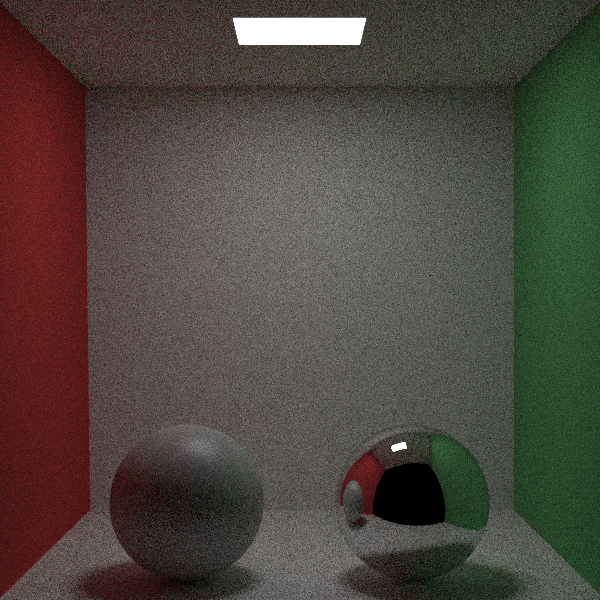

# testpt

## 概要

オブジェクト指向プログラミングやCGの勉強のために作成したC++によるナイーブなパストレーサーです．クラス設計などは[Raytracing in one weekend](https://raytracing.github.io/)のソースコードを参考に作成しています．実行すると三角ポリゴンと球で構成されたシーン(コーネルボックス)をレンダリングします．

## 開発環境

Windows 10  
Microsoft Visual Studio 2019  
C++17

## 実行例

ソースコードをビルドしてください．  
次のコマンドで1ピクセルあたり1000サンプルのパストレーシングを実行し下図のような画像が生成されます．

```bash
testpt.exe 1000
```

<div align="center">
  
</div>

## 機能

Raytracing in one weekendにない機能として以下のものがあります．

- 三角ポリゴンとレイの交差判定
- Wavefront OBJ形式の3Dモデルの読み込み
- マイクロファセットモデルと重点的サンプリング
- 薄膜干渉を考慮した反射率
- 簡単なイメージベーストライティング

これらを用いると下図のような画像を生成することも可能です(別途ポリゴンモデルと環境マップが必要です)．

<div align="center">
  
  
</div>

## 参考文献

T.Moller, B.Trumbore. "Fast, minimum storage ray-triangle intersection" 1997.  
B.Walter, S.R.Marschner, H.Li, K.E.Torrance. "Microfacet Models for Refraction through Rough Surfaces" 2007.  
P.Shirley, R.K.Morley. "Realistic Ray Tracing" 2008.  
M.Pharr, W.Jakob, G.Humphre. "Physically Based Rendering: From Theory To Implementation" 2016.  
P.Shirley. "Raytracing in one weekend" 2020.  
