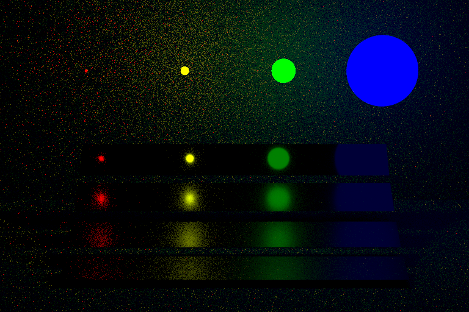
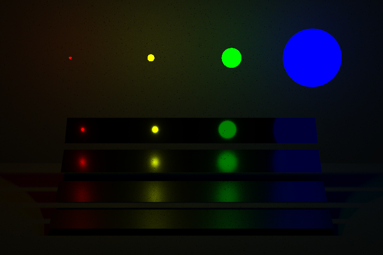

# testpt

## 概要

オブジェクト指向プログラミングやレンダリングの勉強のために作成したC++によるパストレーサーです．クラス設計や実装などは[Raytracing in one weekend](https://raytracing.github.io/)と[pbrt-v3](https://github.com/mmp/pbrt-v3)を参考に作成しています．実行すると三角ポリゴンで構成されたシーン(コーネルボックス)をレンダリングします．

## 開発環境

Windows 10  
Microsoft Visual Studio 2019  
C++17

## 実行例

ソースコードをビルドしてください．  
次のコマンドで，1ピクセルあたり128サンプル(128spp)のパストレーシングが実行され，下図のような画像が生成されます．

```bash
testpt.exe 128
```

<div align="center">
  
</div>

## 機能

Raytracing in one weekendにない機能として以下のものがあります．

- Wavefront OBJ形式の3Dポリゴンモデルの読み込み
- 三角ポリゴンとレイの交差判定 [Moller & Trumbore 1997]
- マイクロファセットBRDFと重点的サンプリング [Walter et al. 07] [Pharr et al. 2016]
- 明示的な光源サンプリングでの多重重点的サンプリング [Pharr et al. 2016]
- 薄膜干渉マテリアル
- 簡単なイメージベーストライティング

これらの機能により下図のような画像を生成することも可能です(別途ポリゴンモデルと環境マップが必要です)．

<div align="center">
  
  
  <p>左: 薄膜干渉による虹色 / 右: 3Dポリゴンモデルのレンダリング</p>
</div>

<br>

多重重点的サンプリング(MIS: Multiple Importnce Sampling)によりモンテカルロ積分の分散を低減してノイズの少ない画像を生成できます．

<div align="center">
  
  
  <p>左: BRDFによる直接光サンプリング / 右: MISによる直接光サンプリング
  <br>モデル出典: https://github.com/wjakob/nori/tree/master/scenes/pa5/veach_mi
  </p>
</div>

## 参考文献

- [Moller & Trumbore 1997] "Fast, minimum storage ray-triangle intersection" JGT. 1997.
- [Walter et al. 07] "Microfacet Models for Refraction through Rough Surfaces". EGSR 2007.
- [Shirley & Morley 2008] "Realistic Ray Tracing". 2008.
- [Pharr et al. 2016] "Physically Based Rendering: From Theory To Implementation" 2016.
- [Shirley 2020]. "Raytracing in one weekend" 2020.
